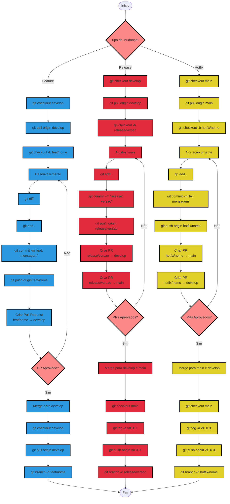

```mermaid
   graph TD
    Start([Início]) --> Decision{Tipo de Mudança?}
    
    %% FEATURE FLOW
    Decision -->|Feature| F1[git checkout develop]
    F1 --> F2[git pull origin develop]
    F2 --> F3[git checkout -b feat/nome]
    F3 --> F4[Desenvolvimento]
    F4 --> F5[git diff]
    F5 --> F6[git add .]
    F6 --> F7[git commit -m 'feat: mensagem']
    F7 --> F8[git push origin feat/nome]
    F8 --> F9[Criar Pull Request<br/>feat/nome → develop]
    F9 --> F10{PR Aprovado?}
    F10 -->|Não| F4
    F10 -->|Sim| F11[Merge para develop]
    F11 --> F12[git checkout develop]
    F12 --> F13[git pull origin develop]
    F13 --> F14[git branch -d feat/nome]
    F14 --> End([Fim])
    
    %% RELEASE FLOW
    Decision -->|Release| R1[git checkout develop]
    R1 --> R2[git pull origin develop]
    R2 --> R3[git checkout -b release/versao]
    R3 --> R4[Ajustes finais]
    R4 --> R5[git add .]
    R5 --> R6[git commit -m 'release: versao']
    R6 --> R7[git push origin release/versao]
    R7 --> R8[Criar PR<br/>release/versao → develop]
    R8 --> R9[Criar PR<br/>release/versao → main]
    R9 --> R10{PRs Aprovados?}
    R10 -->|Não| R4
    R10 -->|Sim| R11[Merge para develop e main]
    R11 --> R12[git checkout main]
    R12 --> R13[git tag -a vX.X.X]
    R13 --> R14[git push origin vX.X.X]
    R14 --> R15[git branch -d release/versao]
    R15 --> End
    
    %% HOTFIX FLOW
    Decision -->|Hotfix| H1[git checkout main]
    H1 --> H2[git pull origin main]
    H2 --> H3[git checkout -b hotfix/nome]
    H3 --> H4[Correção urgente]
    H4 --> H5[git add .]
    H5 --> H6[git commit -m 'fix: mensagem']
    H6 --> H7[git push origin hotfix/nome]
    H7 --> H8[Criar PR<br/>hotfix/nome → main]
    H8 --> H9[Criar PR<br/>hotfix/nome → develop]
    H9 --> H10{PRs Aprovados?}
    H10 -->|Não| H4
    H10 -->|Sim| H11[Merge para main e develop]
    H11 --> H12[git checkout main]
    H12 --> H13[git tag -a vX.X.X]
    H13 --> H14[git push origin vX.X.X]
    H14 --> H15[git branch -d hotfix/nome]
    H15 --> End
    
    %% Styling
    classDef featureStyle fill:#2B98E0,stroke:#000000,stroke-width:2px
    classDef releaseStyle fill:#E02B3D,stroke:#000000,stroke-width:2px
    classDef hotfixStyle fill:#E0CE2B,stroke:#000000,stroke-width:2px
    classDef decisionStyle fill:#FC8888,stroke:#000000,stroke-width:3px
    
    class F1,F2,F3,F4,F5,F6,F7,F8,F9,F10,F11,F12,F13,F14 featureStyle
    class R1,R2,R3,R4,R5,R6,R7,R8,R9,R10,R11,R12,R13,R14,R15 releaseStyle
    class H1,H2,H3,H4,H5,H6,H7,H8,H9,H10,H11,H12,H13,H14,H15 hotfixStyle
    class Decision,F10,R10,H10 decisionStyle
```
