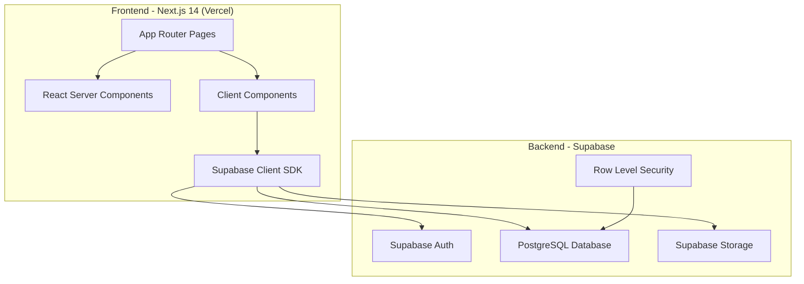
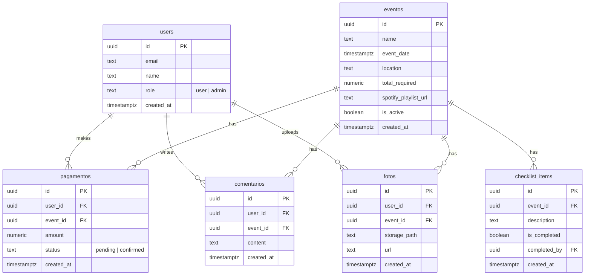

# Feature Design: Churrasco Manager

## Overview

O Churrasco Manager é uma aplicação web full-stack para gerenciamento de eventos de confraternização (churrascos). A aplicação utiliza Next.js 14 (App Router) no frontend, Supabase como backend (Auth, PostgreSQL, Storage), e será deployada na Vercel. O sistema oferece autenticação, dashboard com countdown, gerenciamento de pagamentos via Pix simulado, interação social (comentários e fotos), galeria por evento, ranking de contribuições, checklist colaborativo e playlist Spotify embarcada.

## Architecture

A aplicação segue uma arquitetura de três camadas:



### Key Architecture Decisions

1. **Next.js App Router**: Utiliza Server Components para carregamento inicial rápido e Client Components para interatividade (countdown, formulários, uploads)
2. **Supabase Client-Side SDK**: Comunicação direta do browser com Supabase, eliminando a necessidade de API routes para operações CRUD básicas
3. **RLS como camada de segurança**: Row Level Security no PostgreSQL garante que as políticas de acesso são aplicadas no nível do banco de dados
4. **Supabase Storage**: Armazenamento de fotos com buckets públicos para galeria e políticas de upload por usuário autenticado

## Components and Interfaces

### Pages (App Router)

| Route | Component | Description |
|-------|-----------|-------------|
| `/` | `LoginPage` | Login e cadastro com email/senha |
| `/dashboard` | `DashboardPage` | Página principal com info do evento |
| `/payments` | `PaymentsPage` | Pagamentos do usuário, QR Code Pix |
| `/admin` | `AdminPage` | Gestão de eventos e pagamentos (admin only) |
| `/gallery` | `GalleryPage` | Galeria de fotos por evento |
| `/checklist` | `ChecklistPage` | Checklist do churrasco |

### Core Components

| Component | Props | Description |
|-----------|-------|-------------|
| `CountdownTimer` | `targetDate: Date` | Countdown regressivo com dias/horas/min/seg |
| `PaymentForm` | `eventId: string, userId: string` | Formulário de registro de pagamento |
| `QRCodePix` | `amount: number` | QR Code Pix simulado |
| `RankingList` | `eventId: string` | Ranking de contribuições |
| `CommentFeed` | `eventId: string` | Feed de comentários |
| `PhotoUpload` | `eventId: string` | Upload de fotos com validação |
| `PhotoGallery` | `eventId: string` | Grid responsivo de fotos |
| `ChecklistManager` | `eventId: string, isAdmin: boolean` | Lista de itens do churrasco |
| `SpotifyEmbed` | `playlistUrl: string` | Player Spotify embarcado |
| `Badge` | `type: string` | Badge visual (ex: "Pagador Oficial") |

### Service Layer

```typescript
// lib/services/events.ts
interface EventService {
  getActiveEvent(): Promise<Event | null>;
  createEvent(data: CreateEventInput): Promise<Event>;
  updateEvent(id: string, data: UpdateEventInput): Promise<Event>;
}

// lib/services/payments.ts
interface PaymentService {
  getUserPayments(userId: string, eventId: string): Promise<Payment[]>;
  getUserBalance(userId: string, eventId: string): Promise<{ paid: number; remaining: number }>;
  createPayment(data: CreatePaymentInput): Promise<Payment>;
  confirmPayment(paymentId: string): Promise<Payment>;
  deletePayment(paymentId: string): Promise<void>;
  getRanking(eventId: string): Promise<RankingEntry[]>;
}

// lib/services/social.ts
interface SocialService {
  getComments(eventId: string): Promise<Comment[]>;
  createComment(data: CreateCommentInput): Promise<Comment>;
  getPhotos(eventId: string): Promise<Photo[]>;
  uploadPhoto(file: File, eventId: string): Promise<Photo>;
}

// lib/services/checklist.ts
interface ChecklistService {
  getItems(eventId: string): Promise<ChecklistItem[]>;
  addItem(data: CreateChecklistItemInput): Promise<ChecklistItem>;
  toggleItem(itemId: string): Promise<ChecklistItem>;
  deleteItem(itemId: string): Promise<void>;
}
```

## Data Models

### Database Schema



### TypeScript Interfaces

```typescript
interface User {
  id: string;
  email: string;
  name: string;
  role: 'user' | 'admin';
  created_at: string; // ISO 8601
}

interface Event {
  id: string;
  name: string;
  event_date: string; // ISO 8601
  location: string;
  total_required: number;
  spotify_playlist_url: string | null;
  is_active: boolean;
  created_at: string; // ISO 8601
}

interface Payment {
  id: string;
  user_id: string;
  event_id: string;
  amount: number;
  status: 'pending' | 'confirmed';
  created_at: string; // ISO 8601
}

interface Comment {
  id: string;
  user_id: string;
  event_id: string;
  content: string;
  created_at: string; // ISO 8601
}

interface Photo {
  id: string;
  user_id: string;
  event_id: string;
  storage_path: string;
  url: string;
  created_at: string; // ISO 8601
}

interface ChecklistItem {
  id: string;
  event_id: string;
  description: string;
  is_completed: boolean;
  completed_by: string | null;
  created_at: string; // ISO 8601
}

interface RankingEntry {
  user_id: string;
  user_name: string;
  total_paid: number;
  rank: number;
  is_top_contributor: boolean;
}
```

### Serialization

Todos os modelos utilizam strings ISO 8601 para datas e tipos numéricos nativos do JSON. A serialização/deserialização é feita via `JSON.stringify` / `JSON.parse` com funções auxiliares de validação para garantir type safety:

```typescript
// lib/models/serialization.ts
function serializeModel<T>(model: T): string;
function deserializeModel<T>(json: string, validator: (obj: unknown) => T): T;
```


## Correctness Properties

*A property is a characteristic or behavior that should hold true across all valid executions of a system-essentially, a formal statement about what the system should do. 
Properties serve as the bridge between human-readable specifications and machine-verifiable correctness guarantees.*

### Property 1: Input validation rejects invalid credentials

*For any* string that is not a valid email format, or any password shorter than 6 characters, the validation function SHALL return an error and prevent account creation or login.

**Validates: Requirements 1.3**

### Property 2: Countdown calculation correctness

*For any* target date in the future and any current date before it, the countdown function SHALL return non-negative values for days, hours, minutes, and seconds that correctly represent the time difference. Additionally, reconstructing a date from the countdown components added to the current date SHALL produce the original target date (within 1 second tolerance).

**Validates: Requirements 2.2**

### Property 3: Payment consistency invariant

*For any* event with a total required amount and any sequence of payment creation and deletion operations, the sum of all confirmed individual payment amounts SHALL equal the aggregated total collected, and the remaining amount SHALL equal total_required minus total_collected.

**Validates: Requirements 2.3, 4.5, 10.3**

### Property 4: User balance computation

*For any* user and any set of confirmed payments for that user in an event, the computed "total paid" SHALL equal the sum of confirmed payment amounts, and the "remaining balance" SHALL equal the event's per-user share minus total paid (clamped to zero minimum).

**Validates: Requirements 3.1**

### Property 5: Payment creation status by role

*For any* payment created by a user with role "user", the payment status SHALL be "pending". *For any* payment created by a user with role "admin", the payment status SHALL be "confirmed".

**Validates: Requirements 3.3, 4.4**

### Property 6: Payment amount validation

*For any* numeric value that is zero or negative, the payment validation function SHALL reject the amount and return an error. *For any* positive numeric value, the validation SHALL accept the amount.

**Validates: Requirements 3.5**

### Property 7: Payment history chronological order

*For any* set of payments for a user and event, the payment history function SHALL return them sorted by creation date in ascending chronological order, and each payment entry SHALL include amount, date, and status fields.

**Validates: Requirements 3.4**

### Property 8: Comments reverse chronological order

*For any* set of comments for an event, the comment feed function SHALL return them sorted by creation date in descending (reverse chronological) order.

**Validates: Requirements 5.1**

### Property 9: File upload validation

*For any* file with a MIME type not in {image/jpeg, image/png, image/webp} or with size exceeding 5 MB (5,242,880 bytes), the upload validation function SHALL reject the file. *For any* file with an allowed MIME type and size within 5 MB, the validation SHALL accept the file.

**Validates: Requirements 5.3**

### Property 10: Photos grouped by event year

*For any* set of photos associated with events that have different dates, the grouping function SHALL return photos organized into groups where each group key is the event year, and every photo in a group belongs to an event from that year.

**Validates: Requirements 5.4**

### Property 11: Ranking sorted with badge assignment

*For any* set of confirmed payments across multiple users for an event, the ranking function SHALL return users sorted by total confirmed payment amount in descending order, and SHALL assign the "Pagador Oficial do Churras" badge to exactly the user(s) with the highest total.

**Validates: Requirements 6.1, 6.2**

### Property 12: Checklist item description validation

*For any* non-empty string description, adding a checklist item SHALL succeed. *For any* empty or whitespace-only string, adding a checklist item SHALL be rejected.

**Validates: Requirements 7.2**

### Property 13: Checklist toggle round-trip

*For any* checklist item, toggling its completion status twice SHALL return the item to its original completion state.

**Validates: Requirements 7.3**

### Property 14: Data model serialization round-trip

*For any* valid data model instance (User, Event, Payment, Comment, Photo, ChecklistItem), serializing to JSON and then deserializing back SHALL produce an object equivalent to the original, with all field values and types preserved.

**Validates: Requirements 11.1, 11.2**

## Error Handling

### Client-Side Errors

| Error Type | Handling Strategy |
|-----------|-------------------|
| Form validation errors | Display inline error messages next to the invalid field. Prevent submission. |
| Authentication errors | Display toast notification with specific message (invalid credentials, account exists, etc.) |
| File upload errors | Display error message specifying the issue (wrong type, too large) |
| Network errors | Display toast notification with retry option |

### Server-Side Errors (Supabase)

| Error Type | Handling Strategy |
|-----------|-------------------|
| RLS policy violation | Return 403 with generic "access denied" message. Do not expose policy details. |
| Unique constraint violation | Return specific message (e.g., "email already registered") |
| Foreign key violation | Return specific message about the missing referenced entity |
| Storage quota exceeded | Return message about storage limits |

### Error Response Format

```typescript
interface AppError {
  code: string;       // e.g., "VALIDATION_ERROR", "AUTH_ERROR", "STORAGE_ERROR"
  message: string;    // User-friendly message
  field?: string;     // Optional: which field caused the error
}
```

## Testing Strategy

### Testing Framework

- **Unit Tests**: Vitest (compatible with Next.js, fast execution)
- **Property-Based Tests**: fast-check (JavaScript/TypeScript PBT library, integrates with Vitest)
- **Component Tests**: React Testing Library (for component rendering tests when needed)

### Dual Testing Approach

Unit tests and property-based tests are complementary:
- **Unit tests** verify specific examples, edge cases, and integration points
- **Property-based tests** verify universal properties that should hold across all inputs
- Together they provide comprehensive coverage

### Property-Based Testing Requirements

- Each property-based test MUST use the `fast-check` library
- Each property-based test MUST run a minimum of 100 iterations
- Each property-based test MUST be tagged with a comment in the format: `**Feature: churrasco-manager, Property {number}: {property_text}**`
- Each correctness property MUST be implemented by a single property-based test
- Property tests MUST test core logic functions directly, without mocking

### Test File Organization

```
src/
  lib/
    validators/
      __tests__/
        auth.test.ts          # Unit + PBT for auth validation
        payment.test.ts       # Unit + PBT for payment validation
        upload.test.ts        # Unit + PBT for upload validation
    services/
      __tests__/
        payments.test.ts      # Unit + PBT for payment logic
        ranking.test.ts       # Unit + PBT for ranking logic
        comments.test.ts      # Unit + PBT for comment ordering
        checklist.test.ts     # Unit + PBT for checklist logic
    models/
      __tests__/
        serialization.test.ts # PBT for round-trip serialization
    utils/
      __tests__/
        countdown.test.ts     # Unit + PBT for countdown calculation
        photos.test.ts        # Unit + PBT for photo grouping
```
